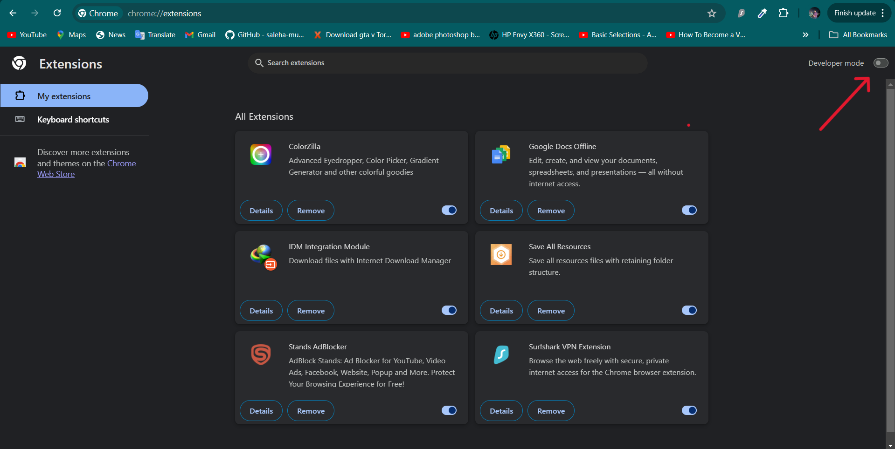
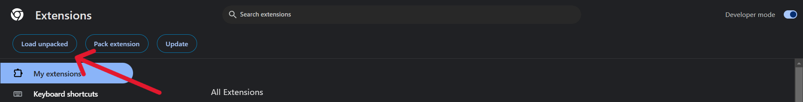
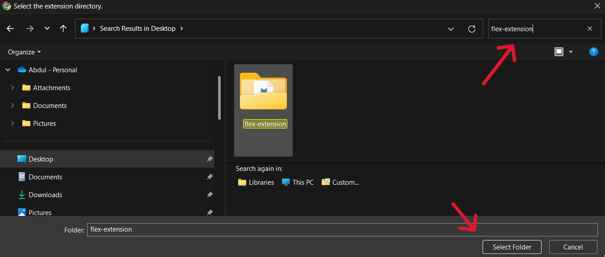
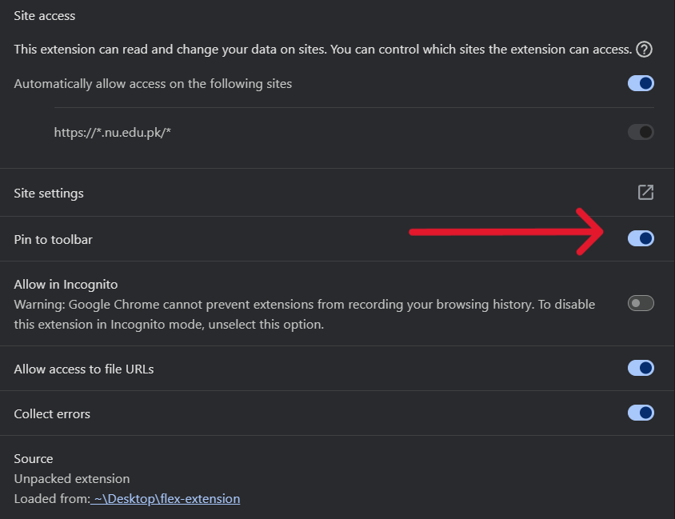
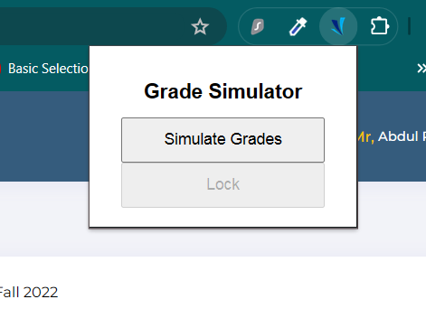

## Flex GPA Simulator

This is a Chrome extension that allows you to predict your SGPA and CGPA by manipulating the Grades on the Flex Student Portal.

## Need

As the finals approach most of us have a curiousity of guessing our grades in particular subject and what that predicted grade would
result in in terms of SGPA .
These predictions make us go to different GPA caluclators on the web and manually enter all the Courses , credit hours and ofcourse their grades
which seems very annoying if we have to calculate the cgpa for more than one semesters.

## Installation Procedure

Follow this installation procedure to get started with the extension. The installation is dependency free and only requires Chrome.

- Clone this repository.

- Unzip the folder.

- Visit `chrome://extensions/`.

- Enable developer mode.

- Click on `Load unpacked` and select the unzipped folder.
  

- Select the folder that you unzipped
  

- Click on Details so that we can pin the extension .

- Scroll a little down and enable the pin to toolbar option.

## Usage

- Visit your Transcript page on FlexStudent Portal.
  

- Click on the Flex-Grade-Simulator from the pinned extensions.

- Click on the Simulate Button to Show the DropDown menu on the Grades.
  

- Click on the Lock Button to remove the DropDown menu after you are done with all the selections .
  

- Click on Simulate Grades to update your transcript again.

## Improvement Courses

- In Order to calculate the SGPA and CGPA of the improvement Courses whose Grades are yet to be Uploaded .
- Update the values of the previously earned grade of that improvement course as well .
- This would give you the correct CGPA for that semester depending on your predicted grades.

## Disclaimer

This code is provided for educational purposes only. The code is not intended to be used for malicious purposes or to gain unauthorized access to any system. The author of this code takes no responsibility for any misuse of the code. Use at your own risk.
